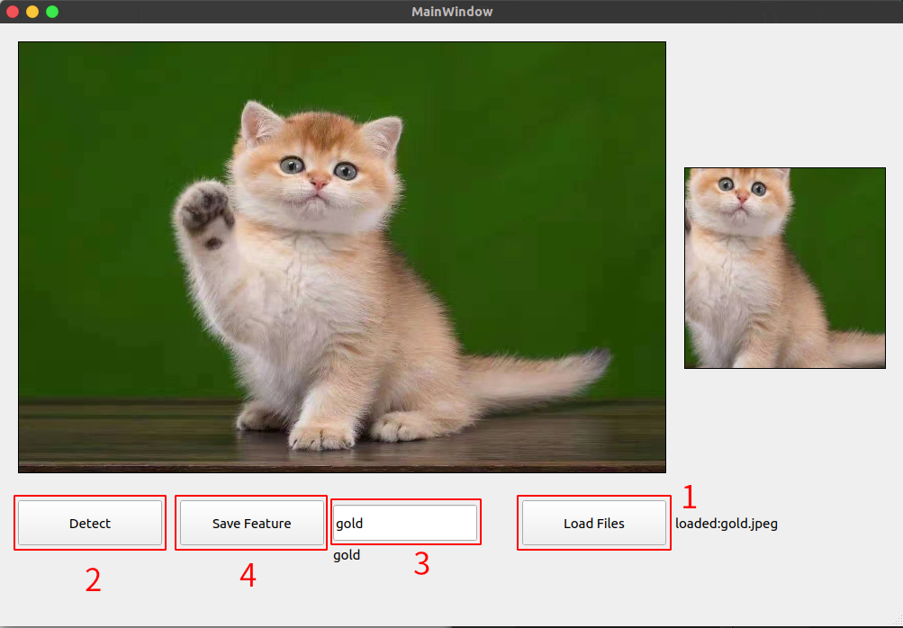
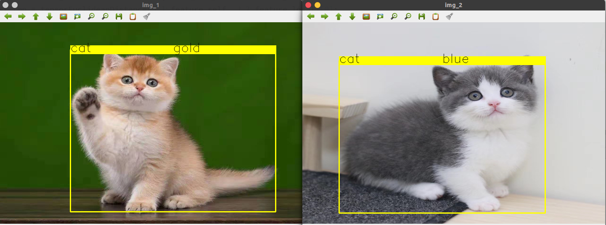

# Cat Recognition

## Basic env
| name           |     version      |
|----------------|:----------------:|
| System         | Ubuntu 20.04 LTS |
| CMake          |      3.10 ≥      |
| OpenCV         |      4.5.0       |
| OpenCV-Contrib |      4.5.0       |
| LibTorch       |      Stable      |
| Python         |       3.8        |
| Torch          |      1.9.0       |
| torchvision    |      0.1.0       |
| Qt             |      5.14.1      |

## 特征提取与保存
- `tools/UI-Tools`



需要下载 Qt 编译项目

执行 yolo 检测后，若只有一只猫，则提取特征信息保存在 `data/feature.csv` 中
- 存储格式为 `name:string [1, 2048]:float`
```csv
gold 0.0175875 0.0263477 0.0230199 0.0207661 0.0227652 ··· 0.0158463 0.0242941 0.0173331
blue 0.0196025 0.0244942 0.0206315 0.0187824 0.0229081 ··· 0.0156323 0.0183714 0.0149517
```

## 测试用例
- `src/example.cpp`



## Reference
- **[https://pytorch.org/](https://pytorch.org/)**
- **[https://pytorch.org/hub/pytorch_vision_resnet/](https://pytorch.org/hub/pytorch_vision_resnet/)**
- **[使用 CV::DNN 模块读取 YOLO v5 ONNX 模型进行实时目标检测](https://sinnammanyo.cn/personal-site/docs/computer/cv/opencv/dnn/opencv-dnn-yolov5-6-0)**
- **[在 C++ 中加载 TorchScript 模型](https://pytorch.apachecn.org/#/docs/1.7/39)**
- **[LOADING A TORCHSCRIPT MODEL IN C++](https://pytorch.org/tutorials/advanced/cpp_export.html)**